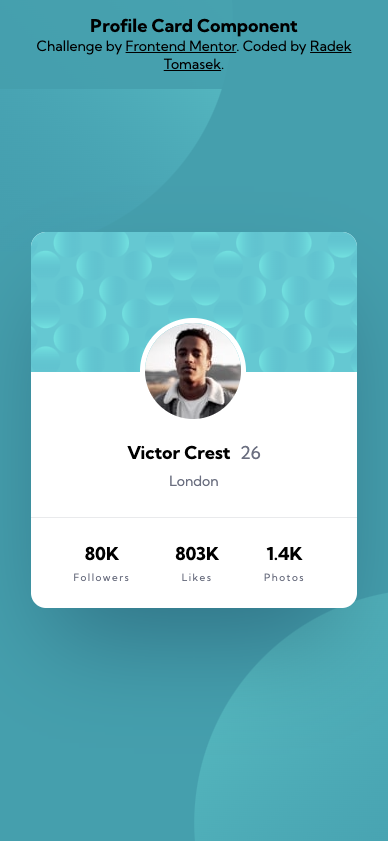
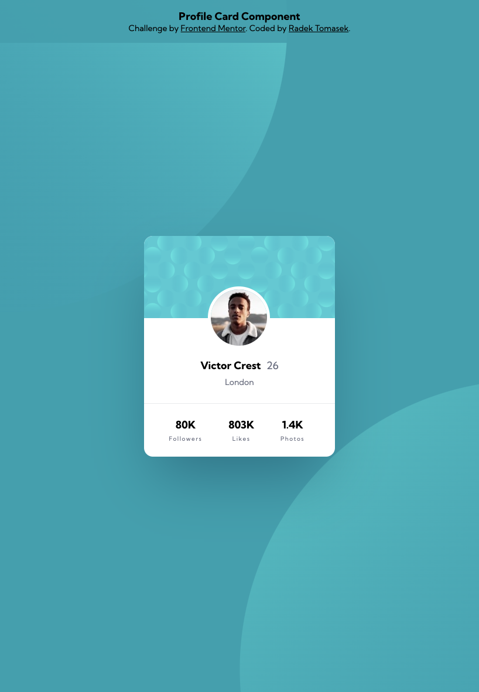
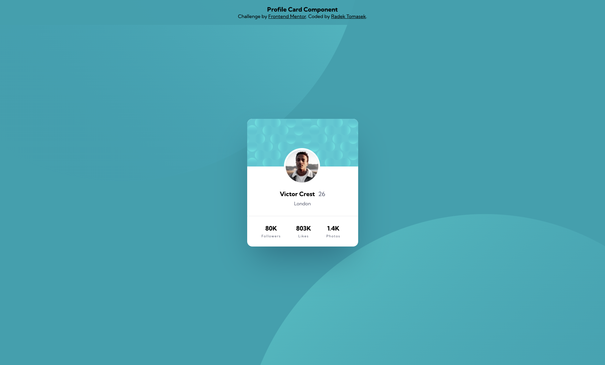

# fm-profile-card-component

This repository contains an implementation of one of the Frontend Mentor Challenges - [Profile Card Component](https://www.frontendmentor.io/challenges/profile-card-component-cfArpWshJ) using HTML/CSS.

## Overview

### The Challenge

[This challenge](https://www.frontendmentor.io/challenges/profile-card-component-cfArpWshJ) was the twelfth one I picked from the [Frontend Mentor](https://www.frontendmentor.io).

The process of creating the solution was quite straighforward, but the completion took my longer as I was experimenting with some new CSS features and approaches. There are quite a few different things compared to my previous solutions, therefore let's breakup them in more details in the next few sections.

### Screenshots

There are a few screenshots captured within the various screen sizes.

#### Mobile Version

This is the **mobile version** as displayed on **iPhone 12 Pro**.

#### Tablet Version

This is the **tablet version** as displayed on **iPad Air**.

#### Desktop Version

This is the **desktop version** as displayed on a large screen.

### Links

- Solution URL: [https://github.com/radektomasek/fm-profile-card-component](https://github.com/radektomasek/fm-profile-card-component)
- Live Site URL: [https://radektomasek.github.io/profile-card-component](https://radektomasek.github.io/profile-card-component)

## My process

**Here are a few hightlights from my implementation**

The complexity of this project was very straightforward. But I decided to spend a little more time to adapt and learn new things.

First new thing to add was a [CSS reset by Andy Bell](https://andy-bell.co.uk/a-modern-css-reset/). On top of the standard stuff, I had usually done before, that CSS reset contains some useful new one and it's nice to have everything in place.

As I still use vanilla CSS, I decided to try a new thing which is [CSS Nesting](https://developer.mozilla.org/en-US/docs/Web/CSS/CSS_nesting).

There is a small change in terms of my usage of units. In the past, I was using `rem` for most of the things, but it makes a sense to keep `rem` mostly for font-sizes and use the `ems` for width/heights and `px` for some small units (letter spacings, borders).

When it comes to colors, I also change the definition a bit and started using more compact form for the variables containing just the value (e.g **228 9% 92%**). The advantage of this approach is that once it's used, it can be just easily wrap by `hsl` with opacity set as an extra value, e.g. `hsl(var(--color-variable) / .7);`.

### Built with

- Semantic HTML5 markup
- Mobile-first workflow
- CSS Flexbox
- CSS Custom Properties (variables)
- [Parcel](https://parceljs.org) - a simple, zero config builder

### Continued development

CSS is trully fascinating and I love its new capabalities. I keep learning it and apply it in the best possible way in the future projects.

## Author

- Frontend Mentor - [@radektomasek](https://www.frontendmentor.io/profile/radektomasek)
- Linkedin - [radektomasek](https://www.linkedin.com/in/radektomasek)
- Twitter - [@radek_tomasek](https://twitter.com/radek_tomasek)
